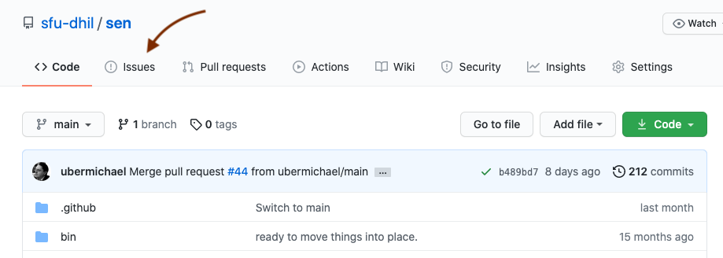
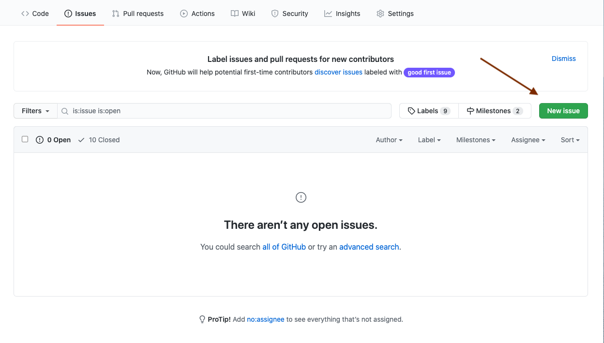
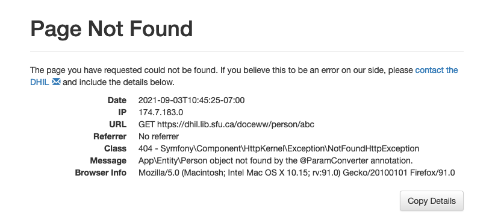
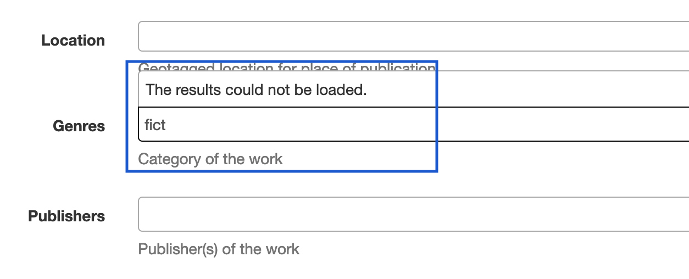

# Bug Reporting Guidelines

This document explains the process for reporting bugs in GitHub.

DHIL projects are collaborative endeavours that require support and contributions from both end users and the project community (developers, PIs, RAs, librarians). To help developers quickly identify and resolve issues with projects, please provide descriptive details of bugs in your reports that you submit on Github**.

## **What’s a Bug?**

A bug is something unexpected that occurs when you use the website. It can be a challenge to figure out if the bug is related to the design or structure of the website or if it’s something related to the user’s operating system or device. That’s why we have a template for reporting bugs that contains several questions.

In the examples below, we are using different repositories and projects. You should use your own project repository for reporting issues. The DHIL will provide you with the address for your repository.

## **Accessing Bug Reports**

Here are the steps to access the bug report template in your **GitHub Repository**. 

1. Ensure that you are in your repository on GitHub by looking for the acronym for your project in the top left-hand corner. In the example below, we know we're in the repository for the Social and Economic Networks Project (SEN) since the link in the corner says `sfu-dhil/sen`. You can also confirm you're in your repository by looking at the About block on the right hand side.    If you're unsure about how to locate your repository, you can email [dhil-projects@sfu.ca](mailto:dhil-projects@sfu.ca) and we can provide you with the link.
 
1.  Click on **Issues**:

1.  Click on **New Issue**:

1. Click on **Bug Report: Get Started**

1. You will arrive at this page:

## Writing a Bug Report

Below are some examples of how you might answer the questions. Please note that answers will vary from these examples because the problems or unexpected events are unique to each project.

### Report Title

Create a short but descriptive title for the bug report. 
 
**Example**:
 
 > Error accessing the book search page

### What isn’t working as expected on the website? 

**Example**:

>  When I add new information to an existing record in the database, I can only see this new information in the website’s backend. I can’t see it in the search results.

### If you encountered an error message, please copy the relevant details or take a screenshot and paste it below. (Type NA if not applicable.)

**Example**:

> 

**Tips**:
 
 * If you see an error message, please use the Copy Details button to copy and paste the information into the bug report.
 * In some cases, a bug won't necessarily produce an error page—i.e. something isn't displaying properly or an input form doesn't contain the correct fields. In those instances, post a screenshot 
 of the page or the area of the page that contains the issue. In 
 the example below, an error occurred without generating an error
 page:

> 

### What is the URL of the page where you encountered the bug? [Type NA if not applicable.]

**Example**:

> https://womensprinthistoryproject.com/title/

**Tips**

* If you are unable to share the full URL (i.e. if your project is currently private), you can also just include the last part of the URL following the main website's URL (i.e. /title/772 rather than http://mywebsite.com/title/772)

### What steps did you take before you encountered the bug?

**Example**:

> 1. Clicked on “Database” in the top header menu and click “Title search”
> 1. Typed in “Records of Woman” and hit “search”
> 1. Clicked on ID 8271
> 1. In this title entry, you see one related title in the related title field: the first edition of Records of Woman
> 1. Clicked “edit” in the ID 8271 title entry
> 1. The related titles table is empty in the back end.

**Tips**

* Here we’re looking for the exact steps you took before the problem occurred. This helps us to **reproduce** the problem so we can start to identify where the bug exists. Please provide information such as: how you got to the error, how often the error occurs, what buttons you’ve clicked, or what was typed. You can number these steps or just use a bullet list. The developer will try to follow these steps in order to reproduce the same error.
* If the problem wasn’t triggered by a specific action, try to describe what you were doing before you noticed the problem  happening.

### What browser, operating system, and device were you using when you encountered the error?

**Example**:

> Chrome (updated), Windows 10, desktop

**Tips**:

 * Here we’re looking for some additional context that might be related to the problem. For instance, problems can occur when using particular browsers or if a browser isn’t updated. We’re also trying to find out if there’s an issue with the way the website works and a particular version of an operating system. Sometimes, a table will look strange on tablets and small displays. The information you provide here helps the developer to reproduce the same problem.
 * The error message generated by the web applications will include browser information. If you copy and paste from the error message you do not need to include the information twice.

### Support 

If you have questions after reading these guidelines, please send us an email at [dhil-projects@sfu.ca](mailto:projects.dhil@sfu.ca) and we’ll be in touch soon.
